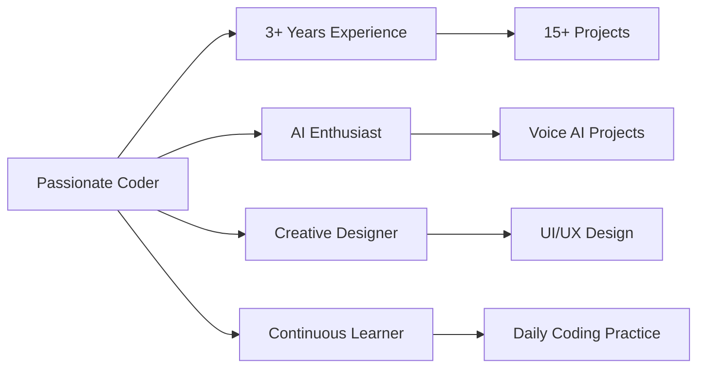

<div align="center">
  
<!-- Animated Header with Glow Effect -->


<!-- VIP Animated Typing Text -->
[](https://git.io/typing-svg)

<!-- VIP Badge Collection -->
<p align="center">
  
  
  
</p>

<!-- Stats with VIP Frame -->
<div align="center">
  
  
</div>

</div>

---

## 🌟 VIP Introduction

<div align="center">

```javascript
class VIPDeveloper {
  constructor() {
    this.name = "Soumya Das";
    this.role = "Full Stack Developer";
    this.education = "IMCA @ Parul University (CGPA: 8.54)";
    this.passion = "Transforming ideas into innovative digital solutions";
    this.specialties = ["Web Development", "AI Integration", "Creative Coding"];
  }
  
  getMotivation() {
    return "Code with creativity, debug with patience, deploy with confidence!";
  }
}
```

</div>

---

## 🛠️ VIP Tech Stack

### 💎 Core Technologies
<div align="center">

| Category | Technologies |
| :--- | :--- |
| **Frontend** |       |
| **Backend** |       |
| **Database** |   |
| **Tools** |    |

</div>

---

## 🏆 VIP Project Gallery

### 🌟 Featured Projects

<div align="center">

| Project | Description | Tech Stack | Status |
| :--- | :--- | :--- | :--- |
| **[AI Voice Chatbot](https://github.com/Soumya-Das-2006/AI-Chatbot-Voice-Search)** | Voice-enabled AI assistant with speech recognition |   |  |
| **[University Website](https://soumya-das-2006.github.io/University-Website-UI/)** | Modern responsive university portal |    |  |
| **[Telegram Chat Bot](https://github.com/Soumya-Das-2006/Telegram-Bot-Massenger-Chat-API)** | Interactive messaging automation |   |  |

</div>

### 🎮 Interactive Demos

<div align="center">

| Game Projects | Tech | Status |
| :--- | :--- | :--- |
| **[Tic-Tac-Toe](https://github.com/Soumya-Das-2006/Tic-Tac-Toe-Game)** |  |  |
| **[Snake Game](https://github.com/Soumya-Das-2006/Snake-Game)** |  |  |
| **[Ludo Game](https://github.com/Soumya-Das-2006/Ludo-Game)** |  |  |

</div>

---

## 📊 VIP Development Analytics

<div align="center">

<!-- GitHub Stats Cards -->


<!-- Streak Stats -->


<!-- 3D Contribution Graph -->
### 🌀 VIP Contribution Landscape


<!-- Activity Graph -->
### 📈 VIP Activity Timeline
[](https://github.com/ashutosh00710/github-readme-activity-graph)

</div>

---

## 🏅 VIP Certifications & Achievements

<div align="center">

| Certification | Provider | Status |
| :--- | :--- | :--- |
| **Web Development** | Great Learning | ✅ Completed |
| **Python Essentials** | Cisco & Cognitive Class | ✅ Completed |
| **Full Stack Development** | Udemy | ✅ Completed |
| **MySQL & Frontend** | IBM & Certiport | ✅ Completed |

</div>

---

## 🌟 VIP Fun Facts

<div align="center">



</div>

---

## 📞 VIP Contact

<div align="center">

### 🔗 Connect With Me

[](https://www.linkedin.com/in/soumya-das-b2613128a)
[](https://github.com/Soumya-Das-2006)
[](https://soumya-das-2006.github.io/Soumya-Das-Portfolio/)
[](mailto:soumyadastopper2006@gmail.com)

### 📧 Direct Contact

- **Email**: soumyadastopper2006@gmail.com
- **Phone**: +91 8159824282
- **Location**: India
- **Status**: Available for collaborations and internships

</div>

---

<div align="center">

## ✨ VIP Conclusion


</div>

---

<div align="center">

### ⭐ Thank you for visiting my VIP profile! 

**"Quality is not an act, it is a habit." - Aristotle**

[](https://star-history.com/#Soumya-Das-2006/AI-Chatbot-Voice-Search&Soumya-Das-2006/University-Website-UI&Soumya-Das-2006/Telegram-Bot-Massenger-Chat-API&Date)

</div>
